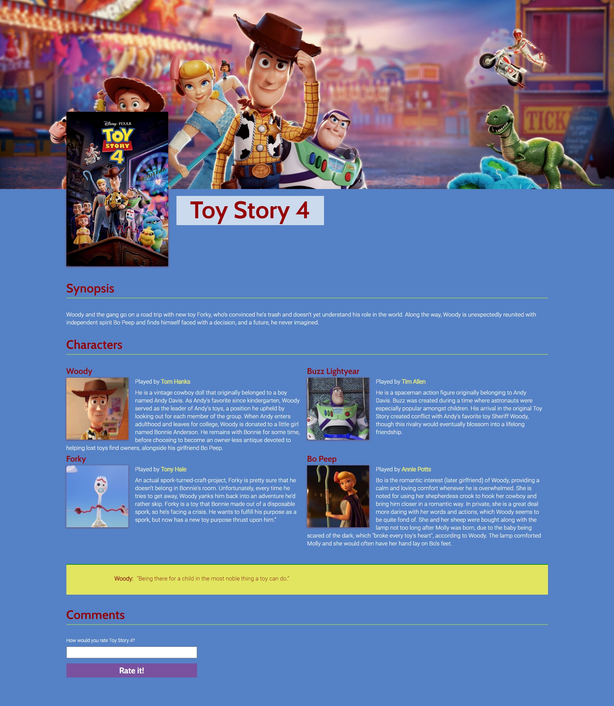
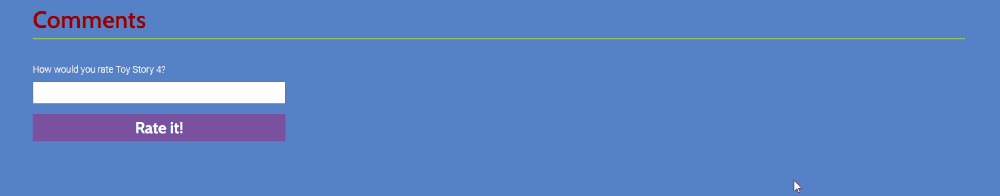

# Admission Challenge - Toy Story 4

## Table of Contents
[Purpose](#purpose)

[Project](#project)

[Requirements](#requirements)

[Getting Started](#getting-started)

[Advice](#advice)

[Submitting your Work](#submitting-your-work)

[Evaluation Criteria](#evaluation-criteria)

[Dos and Don'ts](#dos-and-don'ts)

## Purpose

- We have two main reasons for asking you to do this project;
- To make sure that you have the ability and grit to learn something difficult in a short amount of time.
- To make sure that you have an understanding of basic HTML, CSS and JavaScript.

## Project

You will be building a 1-page website using HTML, CSS, and JavaScript. Don’t worry if you’ve never coded before, this is a super fun project for beginners and we’ll provide you with all the resources you need to succeed 💪🏽.

You will be creating a movie page for Toy Story 4. Here is a snapshot of what your project will look like.

---

## Requirements

### Content

You must use the content provided. Once you open the project, you will see a file called content.md.

### HTML

- Use proper semantic HTML tags as much as possible.
- There should be
  - One h1 tag
  - Two h2 tags
  - A number of p tags
  - Some img tags
  - Other tags as needed
  - Add links to outside sources (ex: links to character wikipedia pages).

### CSS

- Use HTML tags, or classes to target page elements.
- Get your version of the design as close as you can to the provided mockup.
- Create a hover effect (with CSS) on any element.

### JavaScript

- Create an input field at the bottom of the page that will gather visitor comments.
- Create an input that will accept comments from visitors.
- Create a button which submits the comments to the website.
- Create a function that will post the comments to the page.

---

## Getting Started

### Learning the Basics

In order to crush your admissions challenge, you’ll need to learn some HTML, CSS, and JavaScript. We’ve hand selected a few tutorials we recommend starting with, but feel free to use any additional resources you might need.

- [Udacity’s free intro to HTML & CSS](https://www.udacity.com/course/intro-to-html-and-css--ud001)
- [Udacity’s free intro to JavaScript](https://www.udacity.com/course/intro-to-javascript--ud803)
- [flexboxfroggy.com](https://flexboxfroggy.com/)

### Building your Project with CodeSandbox

You will be building your project with an app called codesandbox. To get started:

- Create an account here:  https://codesandbox.io/signin
- Once signed in, go to this URL https://codesandbox.io/s/tech-challenge-toystory-4-xfbd7 
- Create a copy of this project by clicking "file" --> "Fork Sandbox" 
- This is where you will build out your project

## Advice

- Take some time to look over the provided content and mockups. Here are a couple of gifs to give you a better idea of what the actual page looks like.

- We’ve added color codes, and other CSS values that you will need in the styles.css file.
- All of the assets you will need are in the images folder.
- The fonts are already being imported and are available for use in the css file.
- Get as far as you can. This challenge is meant to be difficult and provide you with a challenge that should test your limits.
- Keep in mind that there are many ways of completing the project. Everyone will have a different solution. As long as the rendered page looks like the provided mockup and you haven’t gone against any explicit “don’ts”, you should be fine.

---

## Submitting your Work

In order to submit your work, please save your project in codesandbox and email the URL to kevin@journeyedu.co

## Evaluation Criteria

You have 10 days from the day you applied to send in your admissions challenge. Once we review your work, we will reach out (typically within a day or two) to let you know the next steps.

## Dos and Don’ts

- Do remember what stumped you and problems you had and be prepared to talk about them during your interview.
- Do have the grit to find solutions online. Not every search result will be a winner, but if you persevere, all the answers you need are available online.
- Do be aware that we will be questioning you on your code and the thought that went into it.
- Do write all of the HTML and CSS yourself.
- Do use vanilla JavaScript. This means just plain ol’ JS without any frameworks or libraries.
- Do use Flexbox for your layout.

- Don’t worry about creating a pixel-perfect reproduction of the mockup.
- Don’t try to learn everything there is to know about HTML, CSS and JS. There is way too much to learn and that is what we are here to help with!
- Don’t copy code from outside sources. The code should be your own.
- Don’t use any CSS framework to complete your project.
- Don’t use jQuery.
- Don't use tables in your code.